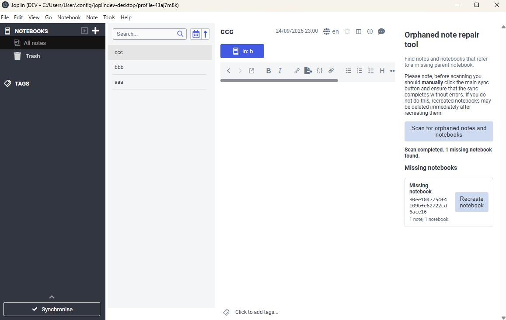
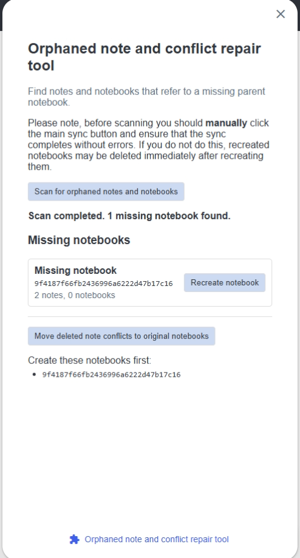

# Orphaned note repair tool

A Joplin desktop and mobile plugin that finds notes and notebooks whose `parent_id` refers to a notebook that no longer exists. Notes in Joplin's virtual Conflicts notebook are excluded from the scan.

On desktop, open **Tools → Orphaned note repair tool**. On mobile, open the plugin panels button and select **Orphaned note repair tool**. Then select **Scan for orphaned notes and notebooks**. Results appear while the paginated scan runs and show only the missing notebook ID plus the number of referencing notes and notebooks. You can stop a scan without losing its results.

Selecting **Recreate notebook** creates a root notebook with the original missing ID. Its title is `Recovered Notebook`, or `Recovered Notebook (2)`, `Recovered Notebook (3)`, and so on when needed to keep the title unique. If the notebook was originally inside a notebook hierarchy, you will need to manually move it back to the correct place, because the parent_id of the notebook cannot be recovered.

## Screenshots

### Desktop

### Mobile

## Demo

https://github.com/user-attachments/assets/384f11e7-48cd-40c2-a9de-af40eeb209e6
